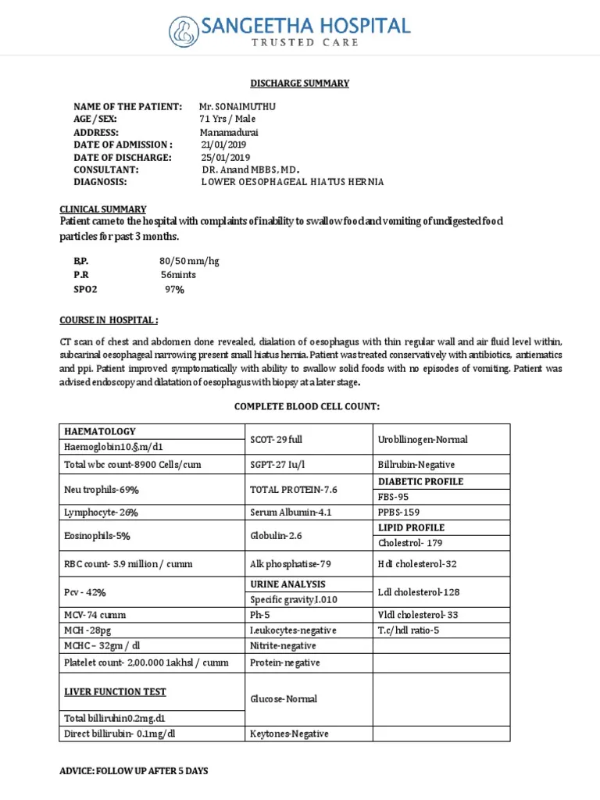

# Doc Transform

This repository contains a suite of document parsing tools aimed at streamlining the extraction and manipulation of information from various document formats.

## Usage

Each tool is contained within its respective directory and is accompanied by usage instructions and examples.

To utilize these tools, refer to the specific documentation within each tool's directory for installation, usage, and integration guidance.

## Installation

1. Clone the repository:

    ```bash
    git clone https://github.com/WadhwaniAI/doc_intelligence.git
    ```

2. Follow the instructions within each tool's directory to install necessary dependencies and configure the tool.

    ```
    conda create -n doc_env python=3.8
    conda activate doc_env
    ```

    - Install all the dependencies
    ```
    cd doc_intelligence
    pip install -r requirements.txt

    ```

## Features

### Deskew

- Corrects skewed document images to ensure proper alignment and readability.

```python

from doc_intelligence.transform import doc_pre_processor as dp

doc_processor = dp.Doc_Preprocessor()
deskewed_image = doc_processor.deskew_image("./path/to/image.jpg")
deskewed_image.show()
```


### Dewarp

- Removes distortions and warping effects from document images, improving visual quality.

### Line Remover

- Eliminates unnecessary lines from documents, enhancing clarity and focus.

```python

from doc_intelligence.transform import doc_pre_processor as dp

doc_processor = dp.Doc_Preprocessor()
image_without_hori_line = doc_processor.line_remover("./path/to/image.jpg", hoiz_line=True)
image_without_hori_line.show()
```


### Shadow Remover

- Efficiently removes shadows and shading effects from document images for improved visibility.

```python

from doc_intelligence.transform import doc_pre_processor as dp

doc_processor = dp.Doc_Preprocessor()
shadowless_image = doc_processor.shadow_remove("./path/to/image.jpg")
shadowless_image.show()
```


### Table Extraction

- Facilitates the extraction of tables from documents, enabling structured data retrieval.

``` python

from extract.information import Document_Information

# get instance
obj = Document_Information()
table_df = obj.extract_table('./data/lab_report/LabReport.jpg', './data/lab_report/test_names.yaml')
table_df.show()
```


### Crop With Jaro

- Crop the lab reports into two parts header and the table. 

``` python

from extract.structure import Document_structure

obj = Document_structure()
im_bottom, im_top  = obj.crop_with_jaro('./data/lab_report/LabReport.jpg', './data/lab_report/test_names.yaml')
im_bottom.save('./data/crop_with_jaro/bottom.jpg')
im_top.save('./data/crop_with_jaro/top.jpg')

```


### Document Question Answering

- Utilizes a powerful question-answering model to extract relevant information from documents based on queries.

``` python

from doc_intelligence.model.qustion_answering.document_question_answering import DocVQA

# get instance
doc_vqa = DocVQA()
answers = doc_vqa.answer_questions(file_type="image", file_path="./invoice.jpg", questions=["what is the name of the patient?", "What is the date of admission?", "What is the name of the doctor?", "What was the diagnosis?"]) 
```



- output JSON

```json
{ "prompt": "What is the name of the patient?", "result": [{ "value": "Mr.SONAIMUTHU", "prob": 1, "start": 15, "end": 17 }]}, 
{ "prompt": "What is the date of admission?", "result": [ { "value": "21/01/2019", "prob": 1, "start": 37, "end": 41 }]},
{ "prompt": "What is the name of the doctor?", "result": [ { "value": "DR.AnandMBBS,MD.", "prob": 0.92, "start": 54, "end": 59}]},
{ "prompt": "What was the diagnosis?", "result": [ { "value": "LOWER OESOPHAGEAL HIATUS HERNIA", "prob": 1, "start": 62, "end": 68 }]}
```

### Handwritten Text Extraction

Capable of accurately extracting handwritten text from document images.


## Contributions

Contributions that enhance or add new document parsing functionalities are highly encouraged! Please refer to the CONTRIBUTING.md file for guidelines on contributing to this project.

## License

This project is licensed under the MIT License - see the [LICENSE](LICENSE) file for details.

## Acknowledgments

We extend our gratitude to the open-source community and contributors whose tools and libraries have been instrumental in developing these parsing tools.

Contact the following members for any query, 

- [Nevil Vekariya](nevil@wadhwaniai.org) - nevil@wadhwaniai.org
- [Sudarshan Sekhar](sudarshan@wadhwaniai.org) - sudarshan@wadhwaniai.org
- [Soma Dhavala](soma@wadhwaniai.org) - soma@wadhwaniai.org