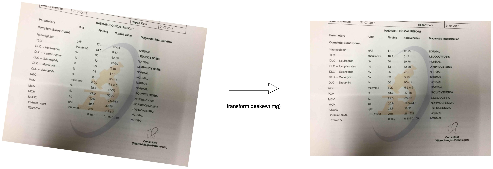

# Doc_Preprocessor Class

## Overview

The `Doc_Preprocessor` class encapsulates various document processing techniques, providing functionalities such as deskewing images, shadow removal, line removal, and image cropping.

## Class Methods

#### `__init__(self)`

Initializes the `Doc_Preprocessor` class, setting up the PaddleOCR model.

### Method 1: `deskew_image`
#### `deskew_image(self, image_path: str) -> PIL.Image`

Deskews the input image based on the bounding box slope.

- #### Arguments:
    - `image_path`: Path of the image to be deskewed.

- #### Returns:
    - Deskewed PIL image.

#### Example:
```python

from doc_intelligence.transform import doc_pre_processor as dp

doc_processor = dp.Doc_Preprocessor()
deskewed_image = doc_processor.deskew_image("./path/to/image.jpg")
deskewed_image.show()
```

<figure markdown>
  { width="700" }
  <figcaption>Image caption</figcaption>
</figure>


### Method 2: `shadow_remove`

#### `shadow_remove(self, image_path: str) -> PIL.Image`

Remove the shadow from the document image.

#### Arguments:
- `image_path`: Path of the image to be deskewed.

#### Returns:
- Pil image after removing the shadow from the document image.

#### Example:
```python

from doc_intelligence.transform import doc_pre_processor as dp

doc_processor = dp.Doc_Preprocessor()
shadowless_image = doc_processor.shadow_remove("./path/to/image.jpg")
shadowless_image.show()
```

<figure markdown>
  { width="700" }
  <figcaption>Image caption</figcaption>
</figure>


### Method 3: `remove_horz_verti_lines`

#### `remove_horz_verti_lines(self, image_path: str, vh_thresh : int = 200, hoiz_line: bool = True, verti_line: bool= False) -> PIL.Image:`

Remove the shadow from the document image.

- #### Arguments:

    - `image_path`: path to the image
    - `vh_thresh`: threshold for the binarization, range [0, 255], default = 200
    - `hoiz_line`: boolean flag for removing horizontal lines
    - `verti_line`: boolean flag for removing vertical lines 

#### Returns:
- Pil image after removing the horizontal/vertical lines from the document image.

#### Example:
```python

from doc_intelligence.transform import doc_pre_processor as dp

doc_processor = dp.Doc_Preprocessor()
image_without_hori_line = doc_processor.remove_horz_verti_lines("./path/to/image.jpg", hoiz_line=True)
image_without_hori_line.show()
```

<figure markdown>
  { width="700" }
  <figcaption>Image caption</figcaption>
</figure>
